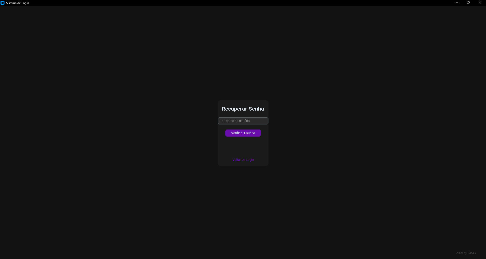

# Sistema de Login com Python e CustomTkinter

Este é um projeto de estudo focado na criação de um aplicativo desktop completo para login de usuários, construído inteiramente em Python. O objetivo foi praticar a criação de interfaces gráficas (UI) modernas, a arquitetura de aplicativos de "página única" (SPA) e a integração com um banco de dados local.

## Funcionalidades

O aplicativo é composto por uma única janela que gerencia diferentes "páginas" (frames) para criar uma experiência de usuário fluida:

* **Tela de Login:** Permite que um usuário existente entre no sistema.
* **Tela de Registro:** Permite a criação de novos usuários com validação de senha.
* **Tela de Recuperação:** Um fluxo para "Esqueci minha senha".
* **Tela de Sucesso:** Uma página de boas-vindas após o login.
* **Interface Moderna:** O layout foi feito com a biblioteca `CustomTkinter`, utilizando um tema escuro personalizado (preto, roxo neon e vermelho).

## Tecnologias Utilizadas

* **Linguagem:** Python 3
* **Interface Gráfica (UI):** `CustomTkinter`
* **Banco de Dados:** `sqlite3` (para armazenamento local de usuários)
* **Segurança:** `hashlib` (para hashing de senhas) e `os` (para geração de `salt`)

## Destaque: Práticas de Segurança

Este projeto foi um teste de criação de software, e a segurança foi um ponto central de aprendizado.

### 1. Armazenamento de Senha (Boa Prática)

As senhas dos usuários **não são salvas em texto puro** no banco de dados. O projeto implementa uma prática de segurança essencial:

* **Hashing:** A biblioteca `hashlib` é usada para criar um hash da senha usando o algoritmo `pbkdf2_hmac` com `sha256`.
* **Salting:** Para cada novo usuário, um `salt` (um valor aleatório) é gerado pela biblioteca `os.urandom` e armazenado junto ao hash. Isso impede ataques de *rainbow table*, mesmo que duas pessoas tenham a mesma senha.

### 2. Validação de Senha

O sistema de registro força o usuário a criar uma senha que atenda a requisitos mínimos de segurança (letra maiúscula, número e símbolo).

---

## ⚠️ Aviso: Limitação da "Prova de Conceito"

É importante notar que, embora o *armazenamento* da senha seja seguro, o *fluxo de recuperação* de senha ("Esqueci minha senha") **não é seguro para um ambiente de produção.**

**O Problema:** Para redefinir a senha, o sistema pede apenas o **nome de usuário**. Como nomes de usuário geralmente não são secretos, qualquer pessoa que saiba o nome de um usuário poderia redefinir a senha dele.

**Por que foi feito assim?**
Este fluxo foi implementado como uma **prova de conceito** (PoC) para demonstrar a capacidade do aplicativo de:
1.  Verificar se um usuário existe no banco.
2.  Apresentar uma nova interface (frame).
3.  Atualizar um registro existente no banco de dados com uma nova senha (corretamente "hasheada" e "salteada").

**Solução em um Caso Real:** Em um aplicativo de produção, este fluxo seria substituído por um sistema de verificação por e-mail, onde um link secreto (token) de uso único é enviado para o e-mail cadastrado do usuário, provando que ele é o dono da conta.

